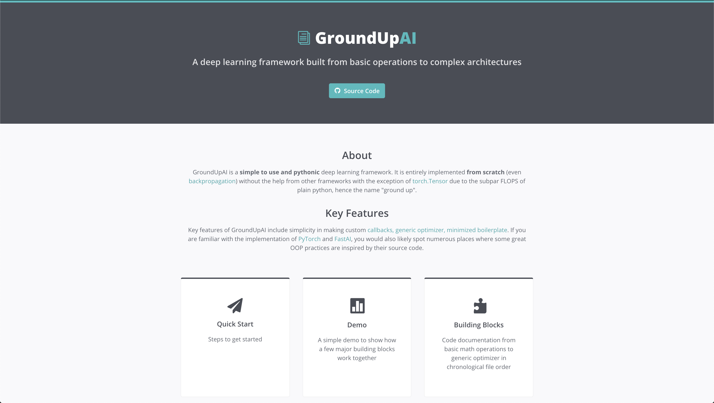

# GroundUpAI
A deep learning library that is entirely implemented from scratch (even backpropagation) without depending on external libraries/frameworks (except for torch.Tensor due to the subpar FLOPS of plain python), hence the name "ground up". 

GroundUpAI aims to make model training more customizable than ever and to reduce the amount of boilerplate code for deep learning. You can look at this [this demo](https://jacklu.tech/GroundUpAI/Demo.html) for some proof. In addition, it also has built-in advanced model architectures (e.g. [ResNet](https://jacklu.tech/GroundUpAI/AdvancedArchitectures.html)).

## Documentation

[Link to full documentation](https://jacklu.tech/GroundUpAI/)\
[Link to quick demo](https://jacklu.tech/GroundUpAI/Demo.html)\
[Link to code documentation](https://jacklu.tech/GroundUpAI/BuildingBlocks.html)

 	

## Files

### Code Files

<pre>
- generate_html.ipynb      - notebook for generating BuildingBlocks panel of the documentation
- generate_scripts.ipynb   - notebook for generating scripts from notebooks
- generate_scripts.py      - python script for generating scripts from notebooks
</pre>

### Directories

<pre>
- demo        - notebook for the library for the demo (documentation)
- docs        - documentation html, css, and js files
- notebooks   - notebooks for development of the library
- scripts     - scripts generated from the notebooks
</pre>